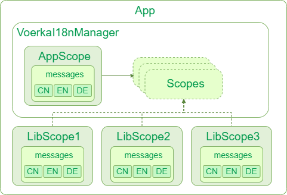

# Multi-Library Integration

> This document explains how to implement coordination and collaboration between multiple libraries

`voerkai18n` supports the coordination and collaboration of internationalization across multiple libraries. This means **when the main program switches languages, all referenced dependent libraries will follow the main program to switch languages**. The entire switching process is transparent to all library developers.
Library developers don't need special configuration; they can develop just like regular applications.

## Basic Principles

The overall architectural principle is as follows:



When we develop an application or library and `import "./languages"`, the following processing occurs in `languages/index.js`:

- Creates an `i18nScope` scope instance
- Detects whether there is a global singleton `VoerkaI18n` in the current application environment
  - If a `VoerkaI18n` global singleton exists, the current `i18nScope` instance will be registered in `VoerkaI18n.scopes`
  - If no `VoerkaI18n` global singleton exists, one will be created using the parameters of the current `i18nScope` instance
- In each application and library, you can use `import { t } from "./languages"` to import the `t` translation function for the current project. This `t` translation function is bound to the current `i18nScope` scope instance, so translation will only use the text from this project. This separates translations between different projects and libraries.
- Since all referenced `i18nScope`s are registered to the global singleton `VoerkaI18n`, when switching languages, `VoerkaI18n` will refresh and switch all registered `i18nScope`s, achieving both independence and synchronized language switching across various `i18nScope`s.

## Usage

Using `VoerkaI18n` in library development is the same as in regular applications, with one difference:

In `languages/index.(js|ts)`, you need to specify the `library` parameter

```javascript
const scope = new VoerkaI18nScope({    
    // ...
    library     : false,                      // Set to true when developing a library
    // ...
}) 
```

- When developing a library, set the `library` parameter to `true`; for applications, set it to `false` or leave it unset.

## Common Questions

### How to use the `t` translation function in libraries?

Using `VoerkaI18n` in library development is exactly the same as in regular applications.

### Will all libraries automatically switch languages when switching the application language?

Yes, each library has a corresponding `i18nScope` instance, and this instance is registered with the global `VoerkaI18n` instance. When calling `i18nScope.change` to switch languages, it essentially calls the `change` method of the global `VoerkaI18n` instance, which notifies all registered `i18nScope` instances to switch languages.

### Are there issues when developing libraries with different versions of VoerkaI18n?

Suppose `lib1` is developed with `VoerkaI18n 2.0`, `lib2` with `VoerkaI18n 2.1`, `lib3` with `VoerkaI18n 2.2`,
and the main application is developed with `VoerkaI18n 2.3`. Will there be any problems?

There are no issues at all; they work together perfectly. All you need to do is:

> Specify the `VoerkaI18n runtime` version dependencies of `lib1`, `lib2`, and `lib3` as `peerDependencies`.

This way, when the main application installs `VoerkaI18n runtime 2.3`, `lib1`, `lib2`, and `lib3` will point to the same version, and their internal `i18nScope`s will automatically register with the global `VoerkaI18n`, ensuring seamless collaboration.

### Whose language configuration takes precedence in a multi-library scenario?

In principle, an application can only have one `i18nScope` with `library=false`, and the language configuration of the entire application follows the main application.

If there are multiple `i18nScope`s with `library=false` in an application, the last one with `library=false` takes precedence.
