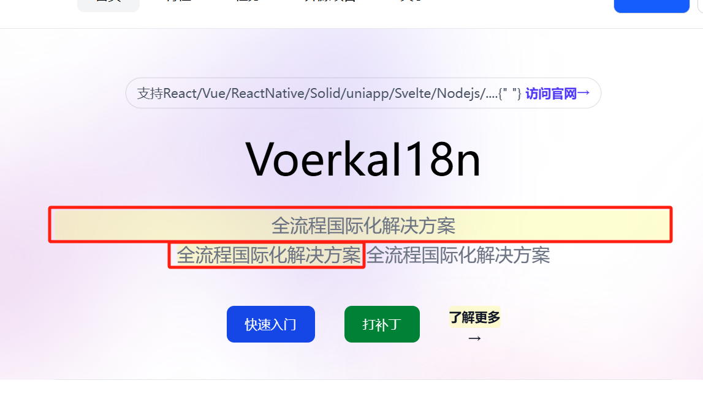

# 在线补丁编辑

`@voerkai18n/patch`提供的实现在线编辑语言包的功能，允许**用户直接在界面上编辑语言包，然后提交到服务器。**


## 使用方法

### 第1步： 安装

::: code-group
```shell [npm]
npm install @voerkai18n/patch
```

```shell [yarn]
yarn add @voerkai18n/patch
```

```shell [pnpm]
pnpm add @voerkai18n/patch
```
:::

### 第2步： 初始化

修改`languages/index.{ts|js}`文件，添加以下代码：

```ts {2}
import { VoerkaI18nScope } from "@voerkai18n/runtime"
import "@voerkai18n/patch"

const messages = {  ... }

export const i18nScope = new VoerkaI18nScope<TranslateComponentType,TransformResultType>({    
    //...
}) 
export const t = i18nScope.t
export const $t = i18nScope.$t
export const Translate = i18nScope.Translate
```

- 只需要导入`import "@voerkai18n/patch"`即可。

### 第3步：激活编辑

当启用`@voerkai18n/patch`后，就可以调用`i18nScope.patch(<true/false>,options)`方法来激活编辑。

```ts {3-5}
import { i18nScope } from "./languages"

i18nScope.patch()        // 激活编辑       
i18nScope.patch(true)    // 激活编辑
i18nScope.patch(false)   // 关闭编辑
```

执行`i18nScope.patch`后，页面中的翻译组件会显示黄色背景，表示可以编辑，如下图所示：




:::warning 提示
在控制台可以直接执行`VoerkaI18n.patch(<true/false>,options)`来激活编辑。
:::

### 第4步：提交修改

当编辑完成后，按下回车或失去焦点，会自动提交修改到服务器。

- 默认提交的地址：`/api/voerkai18n/patch`
- 提交数据格式：

```json
{
    "id": "<messageId或paragraphId>",
    "language": "zh-CN",
    "message": "<修改后的信息>",
    "scope": "<scopeId>"
}
```

### 第5步：更新补丁

当服务器接收到提交的补丁后，需要更新对应的补丁文件即可。

此步骤需要由服务器自己实现。 

### 小结

完成后，就可以进行正常了在线语言补丁流程了，详见[语言补丁](./lang-patch)。


:::warning 提示
`@voerkai18n/patch`只能作用于`Translate`组件，对使用`t`函数封装的内容不能生效。
因为翻译组件对翻译结果使用`HTML tag`进行了包裹。
:::